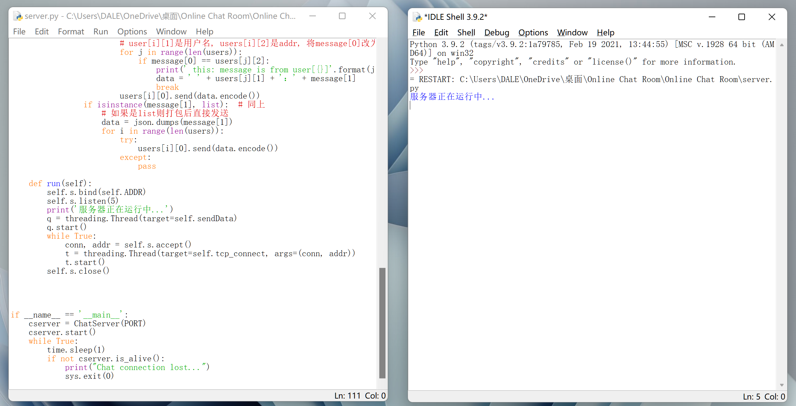
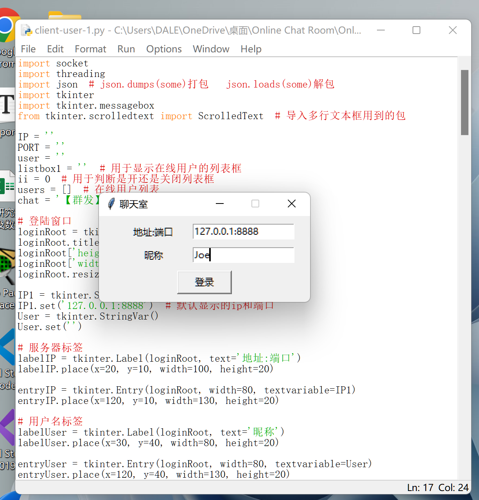
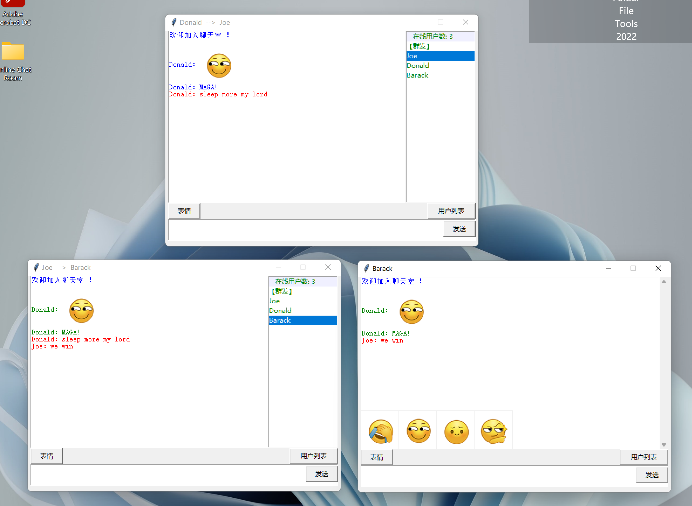
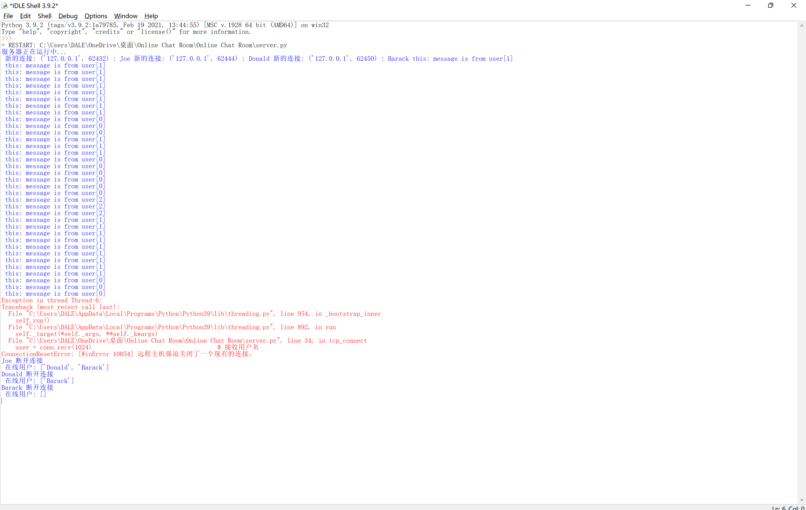

# Online Chat Room

本项目是基于python socket库、tkinter库、threading库实现的基于tcp协议的在线聊天室，采用C/S模式，主要实现登录、群聊、私聊、发送表情功能。服务端实现处理用户登录、多线程接收数据、处理数据，客户端实现连接服务器、聊天GUI、发送数据、群聊私聊、接收数据。

### 部署

* Python3.9.2

### 功能简介
##### 服务器端

* 多线程：对每个socket连接创建启动线程，利用threading库Lock()方法创建锁保证写入数据顺序

##### 客户端

* 登录：自定义服务器端口地址和用户昵称进行登录
* 群聊：在用户列表中点击’‘群发’‘进行群聊
* 私聊：在用户列表中点击目标用户进行私聊
* 发送表情：点击‘’表情‘’标签选择表情发送

### 运行说明

可使用IDLE分别打开项目文件启动，若使用VSC、PyCharm等IDE可能遇到表情图片读取异常，需要对运行配置和工作区目录进行相应设置。

##### 运行截图

